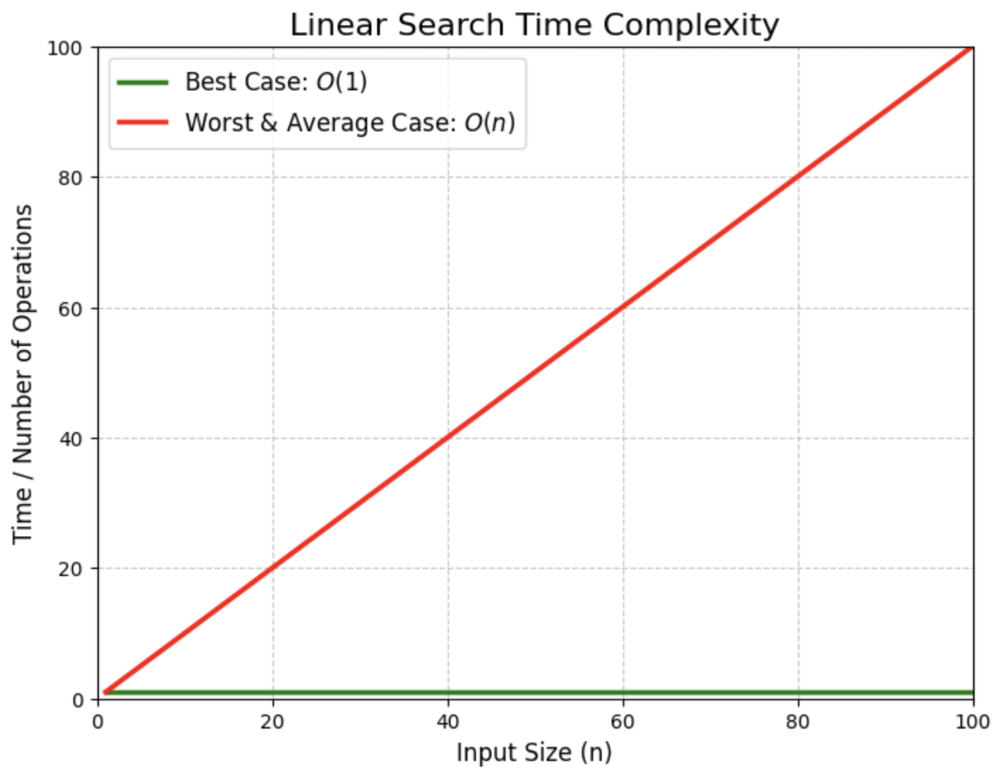

# Linear Search Algorithm

## Time Complexity

* **Best Case:** In the best case, the key might be present at the first index. So the best case complexity is <u>O(1)</u>.
* **Worst Case:** In the worst case, the key might be present at the last index i.e., opposite to the end from which the search has started in the list. So the worst-case complexity is <u>O(N)</u> where N is the size of the list.
* **Average Case:** <u>O(N)</u>

# Applications of Linear Search Algorithm:
1. **Unsorted Lists:** When we have an unsorted array or list, linear search is most commonly used to find any element in the collection.
2. **Small Data Sets:** Linear Search is preferred over binary search when we have small data sets with
3. **Searching Linked Lists:** In linked list implementations, linear search is commonly used to find elements within the list. Each node is checked sequentially until the desired element is found.
4. **Simple Implementation:** Linear Search is much easier to understand and implement as compared to Binary Search or Ternary Search.

## Leetcode Problem

* [1295](https://leetcode.com/problems/find-numbers-with-even-number-of-digits/)

* [1672](https://leetcode.com/problems/richest-customer-wealth/description/?envType=problem-list-v2&envId=2z2hdbu2) 