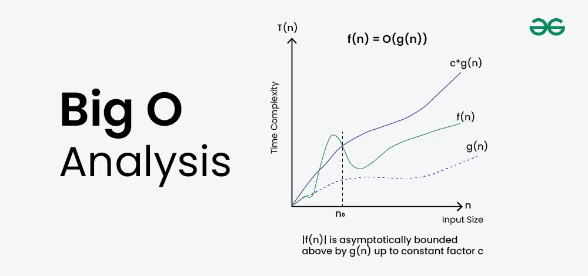

# 📘 Data Structures and Algorithms (DSA)

## 🧠 What is Big O?

Big O Notation is a mathematical way to describe the **performance** of an algorithm as the input size grows.

1. 🔴 **Represents Worst-Case Complexity**  
   Big O describes the **maximum time or space** an algorithm may take in the worst-case scenario.

2. 🟡 **Describes Growth with Input Size**  
   It focuses on how performance changes as input increases — not exact speed or runtime.

3. 🟢 **Measures Efficiency (Time & Space)**  
   It helps analyze how **time (execution)** and **space (memory)** usage scale with input.

---

## 🧮 What is Time and Space Complexity?

1. 🚫 **Hardware Doesn’t Matter in Big O**  
   CPU, OS, or RAM may affect real performance, but Big O **only focuses on algorithm growth**.

2. 📏 **Definitions:**
   - ⏱️ **Time Complexity**: How execution time grows with input size.
   - 💾 **Space Complexity**: How memory usage grows with input size.

3. 🎯 **This Guide Focuses on Time Complexity**  
   We’ll break down time complexities with examples to help you **analyze algorithm behavior** easily.

---

## ⚙️ Common Time & Space Complexities

| Complexity Type       | Big O Notation | Description          |
|-----------------------|----------------|----------------------|
| Constant              | O(1)           | Best – No matter the input size, runtime stays the same. |
| Linear                | O(n)           | Grows proportionally with input size. |
| Logarithmic           | O(log n)       | Cuts problem size in half each time. |
| Linearithmic          | O(n log n)     | Slightly worse than linear. |
| Quadratic             | O(n²)          | Nested loops – becomes slow fast. |
| Exponential           | O(2ⁿ)          | Increases rapidly – avoid. |
| Factorial             | O(n!)          | Very slow – used rarely. |

---

## 💡 When to Use What?

| Big O Notation | Rating        | Example Use Case                  |
|----------------|---------------|-----------------------------------|
| O(1)           | ✅ Excellent   | Array element access              |
| O(log n)       | 👍 Good        | Binary Search                     |
| O(n)           | 🟡 Fair        | Linear Search                     |
| O(n log n)     | 🔻 Poor        | Merge Sort                        |
| O(n²), O(2ⁿ), O(n!) | ❌ Worst  | Brute force, Recursion-heavy logic |

---

## 📊 Time Complexity Graph

<p align="center">
  
</p>

---

## 📌 Important Points

- **Best Case**: Ideal input condition (e.g., first match in linear search).
- **Worst Case**: Input that causes max operations (usually used in Big O).
- **Average Case**: Performance over random input distribution.

- **Always consider trade-offs**: A faster algorithm may use more space and vice versa.

- Use **Hash Tables, Sets** for fast lookup (O(1) or O(log n) time).
- Avoid **nested loops** unless necessary — they often lead to O(n²) time.

<br/>

# 📊 Understanding the Graph in the Image

<p align="center">
  
</p>

### 📈 Axis Explanation:
- **X-axis (n):** Input size (like number of elements in an array).
- **Y-axis (T(n)):** Time complexity (how long the algorithm takes).

---

## 🟢 Graph Lines:
1. `f(n)` – the actual time complexity of your algorithm.
2. `g(n)` – a known function that bounds `f(n)` from above (a simpler function like `n`, `n²`, etc.).
3. `c * g(n)` – a scaled version of `g(n)` to show that `f(n)` stays below it after a certain point (`n₀`).

### The statement `f(n) = O(g(n))` means:  
> "After a certain input size `n₀`, the time taken by `f(n)` will always be less than or equal to a constant multiple (`c`) of `g(n)`."

---

## 💡 Example: Linear Search

Let’s say you’re searching for a number in an unsorted list.

### Code Example:

```python
def linear_search(arr, target):
    for num in arr:
        if num == target:
            return True
    return False
```

- **Best Case:** Found at beginning → `O(1)`
- **Worst Case:** Found at end or not at all → `O(n)`

| Term       | Value   | Explanation                                      |
|------------|---------|--------------------------------------------------|
| `f(n)`     | 5n + 3  | Actual steps (loop body takes 5 units per item) |
| `g(n)`     | n       | Linear function                                 |
| `c * g(n)` | 6n      | Scaled upper bound (c = 6)                      |

✅ After some point, `5n + 3 < 6n` → So `f(n) = O(n)`

Here:
- `f(n)` is the actual time to search.
- We say `f(n) = O(n)` → Because time grows linearly with input size.

---

## 📌 Why It’s Important
1. ✅ Helps choose the best algorithm for big input sizes.
2. 🔍 Helps analyze performance without running the code.
3. 🔁 Used to compare two or more solutions.

---

## 🧮 Common Big O Examples

| Algorithm   | Big O    | Meaning                          |
|-------------|----------|----------------------------------|
| Constant    | O(1)     | Time doesn’t grow with input     |
| Linear      | O(n)     | Time grows with input            |
| Logarithmic | O(log n) | Very efficient (e.g., binary search) |
| Quadratic   | O(n²)    | Slower for large inputs          |
| Exponential | O(2ⁿ)    | Very slow, grows too fast        |

---
